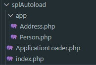

# SPL

Example to using tha function spl_autoload_register, where do import files in you project.


## Directory struct




## ApplicationLoader.php
```php
class ApplicationLoader
{

    private function load($class)
    {   
        if(file_exists("app/{$class}.php")){
            require_once "app/{$class}.php";
            return true;
        }
    }

    public function register()
    {
        spl_autoload_register([$this, 'load']);
    }
}

$load = new ApplicationLoader;
$load->register();
```

## index.php
```php
require_once ("ApplicationLoader.php");


var_dump(new Person);
var_dump(new Address);
```

The classes Person and Address are in directory app

## Person
```php
class Person
{

}
```